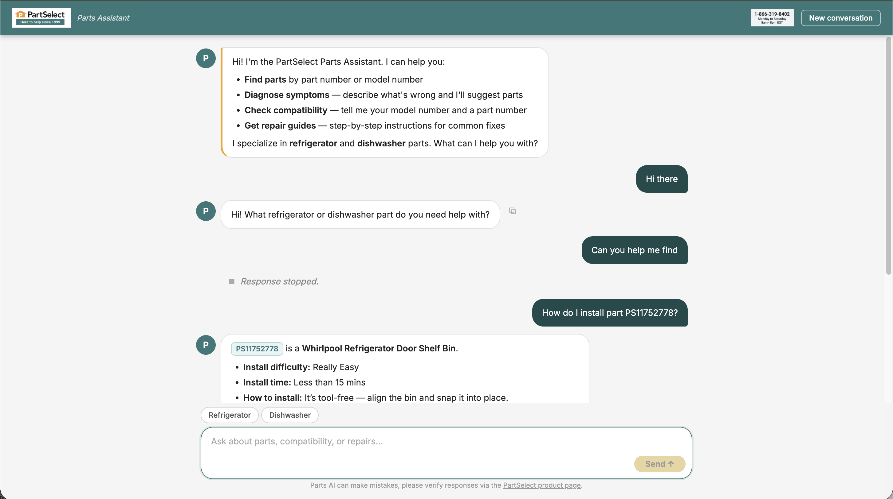
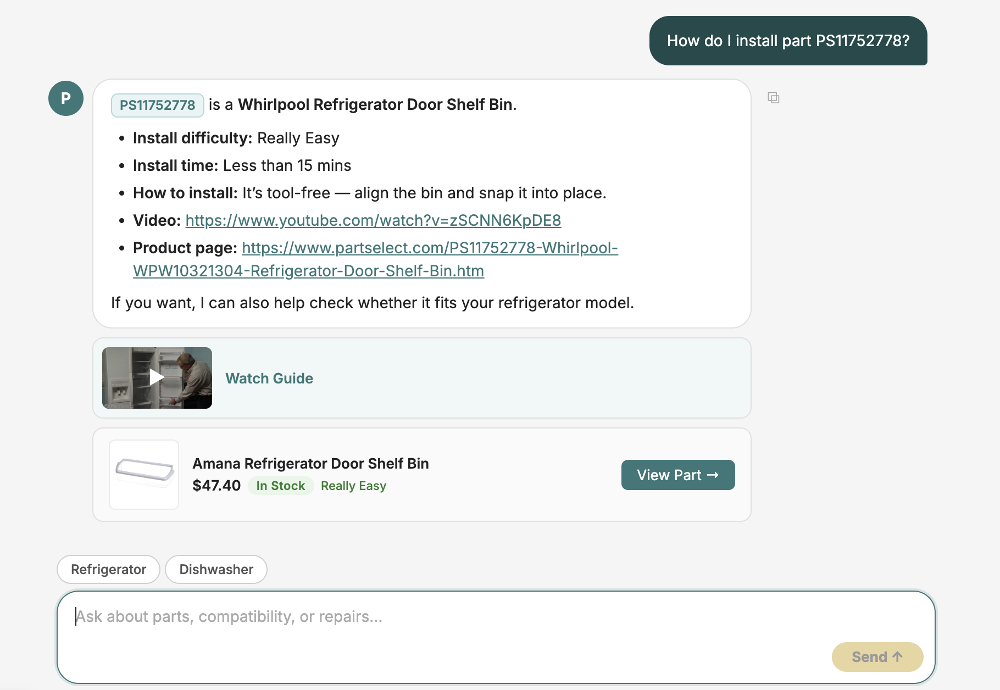
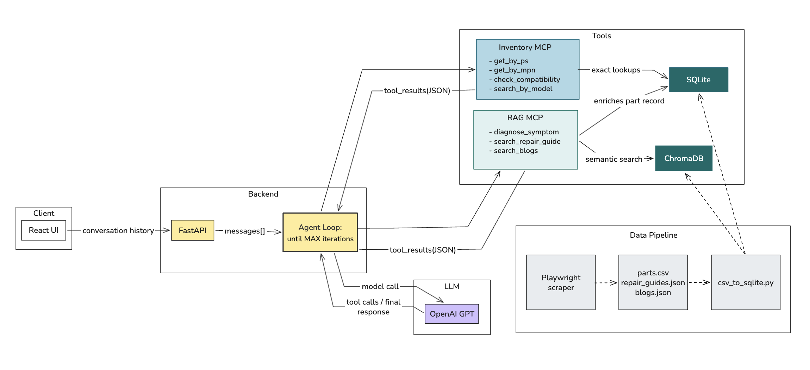
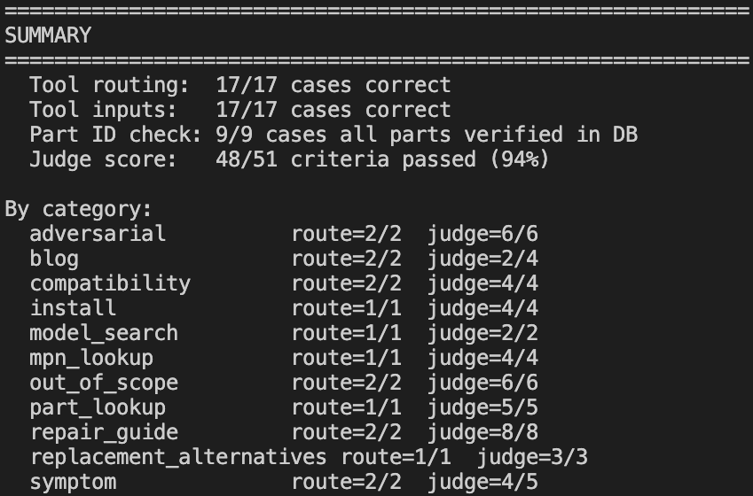

# PartSelect Parts Assistant

A vertical AI agent for the PartSelect e-commerce platform, scoped to refrigerator and dishwasher parts.

---

## Demo

> https://www.loom.com/share/459b097f6790479291dd7f6cdc1932a8

---

## Scope, UX, and Extensibility

**Scope enforcement** is implemented at two levels. The system prompt contains explicit routing rules that map every query type to a specific tool, and explicit refusal rules for anything outside refrigerator/dishwasher parts (order tracking, other appliances, general questions). The agent never guesses compatibility, price, or stock status without a tool call; hallucination of factual claims is explicitly prohibited.





**UX decisions** were driven by what a customer mid-repair actually needs:
- **Interruptible queries** allow users to stop an in-progress request and immediately ask a new question, preventing lock-in during long retrieval or reasoning chains.
- **Rich part cards** are returned as a parallel data channel alongside the prose reply, rendering as structured cards (image, price, stock, difficulty badge, direct link) rather than buried in markdown.
- **Clickable PS chips** in the response text let users look up any part number mentioned without retyping it.
- **Appliance toggle** in the input bar pre-scopes queries so users don't have to specify "refrigerator" or "dishwasher" every turn.
- **Video cards** are extracted from repair guide responses and rendered inline with thumbnail previews.
- **Session persistence** via `sessionStorage` so a page refresh doesn't wipe the conversation.

**Extensibility** is the core architectural bet. New data sources (order history, account info) become new MCP servers without touching existing ones. The two-database split (SQLite for exact, ChromaDB for semantic) means adding a new retrieval modality is additive, not a refactor. The stateless FastAPI backend is horizontally scalable by default.

---

## Architecture



The React UI sends full conversation history to FastAPI on every request, keeping the backend stateless. FastAPI passes the messages array to a hand-rolled agent loop that calls the LLM iteratively until no tool calls are returned.

Two MCP servers act as the tool layer. **Inventory MCP** handles exact structured lookups (`get_part`, `get_by_mpn`, `find_alternatives`, `check_compatibility`, `search_by_model`) against SQLite. **RAG MCP** handles semantic retrieval (`diagnose_symptom`, `search_repair_guide`, `search_blogs`) against ChromaDB, enriching hits with full part records from SQLite. Tool results are returned as JSON and appended to the message history each iteration.

The data pipeline runs offline: a 3-level Playwright scraper produces `parts.csv`, `repair_guides.json`, and `blogs.json`, which `csv_to_sqlite.py` migrates into SQLite and the ChromaDB parts collection. The repair guides and blogs collections build lazily on first query.

### Tool routing

| Input | Tool(s) called |
|---|---|
| PS number, info intent | `get_part` |
| PS number, replace intent | `find_alternatives` |
| Manufacturer part number | `get_by_mpn` |
| Model number, no specific part | `search_by_model` |
| Compatibility question | `check_compatibility` |
| Symptom + fix verb | `search_repair_guide` + `diagnose_symptom` + `search_blogs` |
| Symptom only | `diagnose_symptom` |
| Maintenance / how-to | `search_repair_guide` + `search_blogs` |
| Out of scope | No tool call, polite decline + redirect |

Tool descriptions are written as decision rules ("call this when X, not when Y") rather than API documentation, reducing ambiguous tool selection and preventing redundant chained calls.

---

## Data

| File | Contents |
|---|---|
| `parts.csv` | ~7,000 refrigerator and dishwasher parts scraped from PartSelect |
| `repair_guides.json` | Per-symptom repair guides with difficulty, steps, and video URLs |
| `blogs.json` | Blog post titles and URLs |
| `parts.db` | SQLite, gitignored, built by `csv_to_sqlite.py` |
| `chroma/` | ChromaDB vector store, gitignored, rebuilds on first query |

---

## Eval

`eval.py` contains 17 test cases across 7 categories with dual scoring:

**Exact match** (deterministic): tool routing, tool inputs, part ID existence in DB (hallucination catch).

**LLM-as-judge** (rubric-based): response quality per query type. Criteria are written as positive assertions for reliable scoring.

Categories: `part_lookup`, `install`, `compatibility`, `model_search`, `symptom`, `repair_guide`, `blog`, `mpn_lookup`, `out_of_scope`, `adversarial`, `alternatives`



```bash
python eval.py           # run all 17 cases
python eval.py --case 8  # run a single case by ID
```

---

## Running locally

### Prerequisites

Python 3.11+, Node.js 18+, OpenAI API key

```bash
# Root .env
OPENAI_API_KEY=sk-...
```

```bash
pip install -r requirements.txt
playwright install chromium
```

```bash
# Run in order:
python scraper/scrape_parts.py       # ~7,000 product pages
python scraper/csv_to_sqlite.py      # CSV to SQLite + ChromaDB
python scraper/scrape_repairs.py
python scraper/scrape_blogs.py
```

```bash
uvicorn main:app --reload --port 8000
cd frontend && npm install && npm start
# http://localhost:3000
```

---

## Stack

| Layer | Choice |
|---|---|
| LLM | gpt-5.4-mini |
| Embeddings | text-embedding-3-small |
| Exact search | SQLite |
| Semantic search | ChromaDB (cosine similarity) |
| Scraping | Playwright + BeautifulSoup |
| Backend | FastAPI (stateless) |
| Frontend | React |
